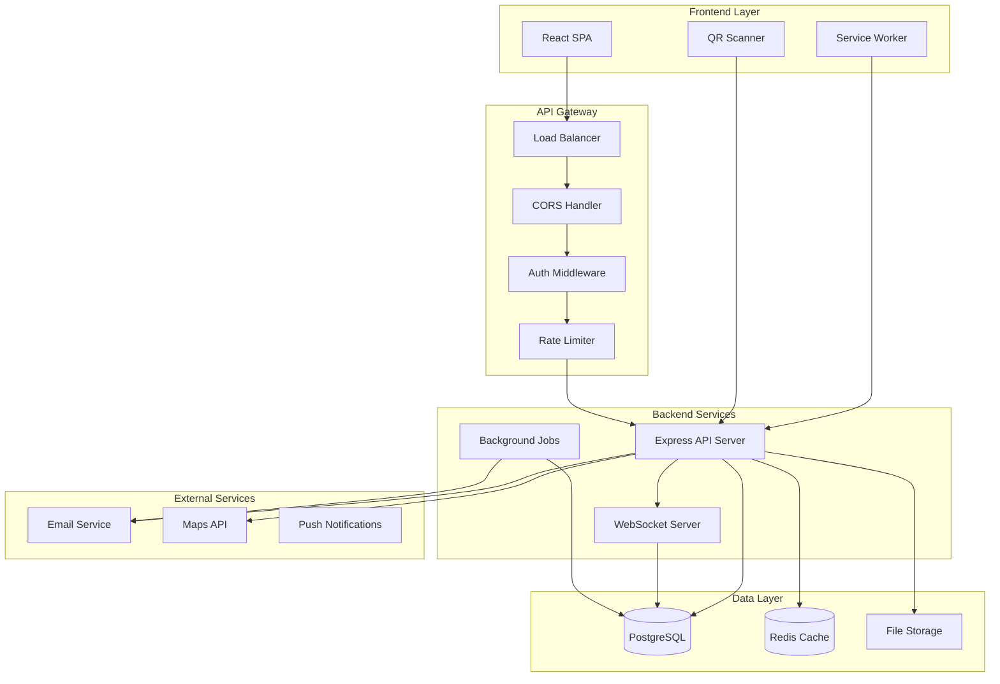
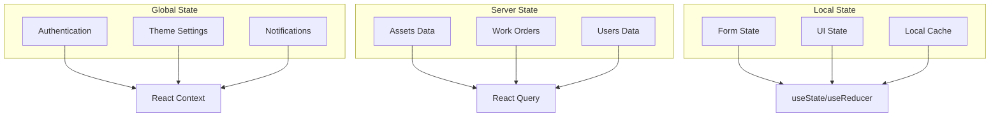
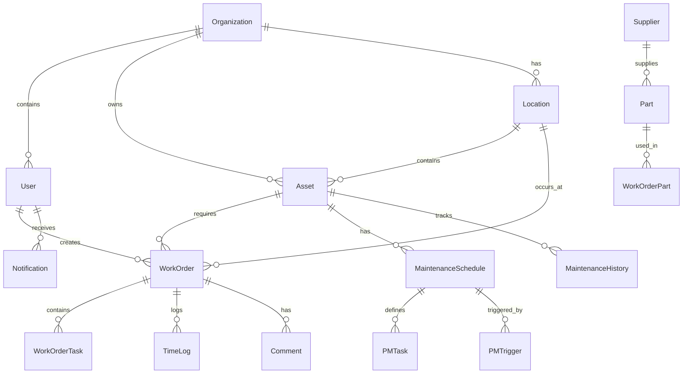
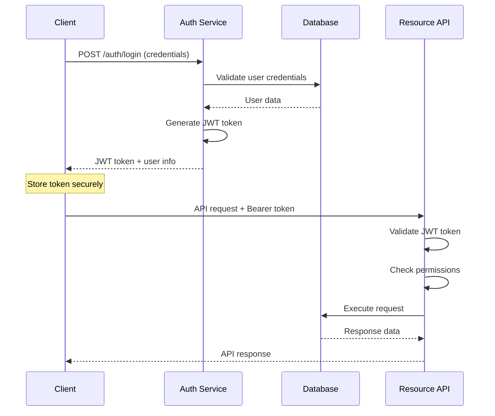

# 🏗️ System Architecture

Comprehensive architecture documentation for the Compass CMMS system.

## 📋 Table of Contents

- [Overview](#overview)
- [High-Level Architecture](#high-level-architecture)
- [Backend Architecture](#backend-architecture)
- [Frontend Architecture](#frontend-architecture)
- [Database Design](#database-design)
- [Security Architecture](#security-architecture)
- [Integration Patterns](#integration-patterns)
- [Deployment Architecture](#deployment-architecture)
- [Scalability Considerations](#scalability-considerations)

## Overview

**Compass CMMS** follows a modern, microservices-inspired architecture with clear separation of concerns:

- **Frontend**: React SPA with TypeScript and Material-UI
- **Backend**: Node.js/Express REST API with TypeScript
- **Database**: PostgreSQL with Prisma ORM
- **Real-time**: WebSocket connections for live updates
- **Storage**: Cloud-based file storage (S3/Vercel Blob)
- **Deployment**: Containerized with Docker, deployed on cloud platforms

### Key Architectural Principles

1. **Separation of Concerns**: Clear boundaries between layers
2. **Domain-Driven Design**: Business logic organized by domain
3. **API-First**: Well-defined contracts between frontend and backend
4. **Type Safety**: TypeScript throughout the stack
5. **Progressive Web App**: Offline capabilities and mobile-first design
6. **Security by Design**: Authentication, authorization, and data protection

## High-Level Architecture



## Backend Architecture

### Layered Architecture

```
┌─────────────────────────────────────────────────┐
│                API Layer                        │
│  Controllers → Route Handlers → Middleware     │
├─────────────────────────────────────────────────┤
│               Business Layer                    │
│     Services → Domain Logic → Validation       │
├─────────────────────────────────────────────────┤
│               Data Access Layer                 │
│       Repositories → ORM → Database             │
└─────────────────────────────────────────────────┘
```

### Domain Organization

Each business domain follows the same structure:

```
src/api/{domain}/
├── {domain}.controller.ts    # HTTP request handling
├── {domain}.service.ts       # Business logic
├── {domain}.router.ts        # Route definitions
├── {domain}.types.ts         # Domain-specific types
└── __tests__/                # Unit tests
```

**Core Domains:**
- **Assets**: Physical asset management
- **Work Orders**: Maintenance task lifecycle
- **Maintenance**: Preventive maintenance scheduling
- **Inventory**: Parts and supplies management
- **Notifications**: Real-time alerts and messaging
- **Users**: User management and authentication
- **Portals**: Public-facing forms and interfaces

### Service Layer Architecture

```typescript
// Example: Asset Service Architecture
class AssetService {
  constructor(
    private assetRepository: AssetRepository,
    private notificationService: NotificationService,
    private fileService: FileService
  ) {}

  async createAsset(data: CreateAssetRequest): Promise<Asset> {
    // 1. Validate business rules
    await this.validateAssetData(data);
    
    // 2. Create asset
    const asset = await this.assetRepository.create(data);
    
    // 3. Handle side effects
    await this.notificationService.notify({
      type: 'ASSET_CREATED',
      assetId: asset.id
    });
    
    // 4. Return result
    return asset;
  }
}
```

### Middleware Stack

```typescript
app.use(helmet());                    // Security headers
app.use(cors(corsOptions));          // CORS configuration
app.use(morgan('combined'));         // Request logging
app.use(express.json({ limit: '10mb' })); // Body parsing
app.use('/api', rateLimiter);        // Rate limiting
app.use('/api', authenticate);       // JWT authentication
app.use('/api', router);             // API routes
app.use(errorHandler);               // Global error handling
```

## Frontend Architecture

### Component Architecture

```
src/
├── components/                # Reusable UI components
│   ├── Layout/               # Layout components
│   ├── Forms/                # Form components
│   ├── Common/               # Shared components
│   └── {Feature}/            # Feature-specific components
├── pages/                    # Route components
├── hooks/                    # Custom React hooks
├── services/                 # API communication
├── types/                    # TypeScript definitions
├── utils/                    # Utility functions
└── theme/                    # MUI theme configuration
```

### State Management Strategy



### Data Flow Pattern

```typescript
// 1. Component requests data
const AssetList = () => {
  const { data: assets, isLoading } = useAssets(filters);
  
  const handleCreateAsset = (assetData) => {
    createAssetMutation.mutate(assetData);
  };
  
  return (
    <AssetTable 
      assets={assets} 
      loading={isLoading}
      onCreateAsset={handleCreateAsset}
    />
  );
};

// 2. Custom hook manages server state
const useAssets = (filters) => {
  return useQuery({
    queryKey: ['assets', filters],
    queryFn: () => assetService.getAssets(filters),
    staleTime: 5 * 60 * 1000
  });
};

// 3. Service handles API communication
const assetService = {
  getAssets: (filters) => 
    apiClient.get('/assets', { params: filters }),
    
  createAsset: (data) =>
    apiClient.post('/assets', data)
};

// 4. API client manages HTTP details
const apiClient = axios.create({
  baseURL: process.env.VITE_API_BASE_URL,
  timeout: 10000
});
```

## Database Design

### Entity Relationship Overview



### Core Entity Definitions

```typescript
// Core business entities with relationships
interface Organization {
  id: number;
  name: string;
  settings: OrganizationSettings;
  users: User[];
  assets: Asset[];
  locations: Location[];
}

interface Asset {
  id: number;
  name: string;
  status: 'ONLINE' | 'OFFLINE';
  criticality: 'LOW' | 'MEDIUM' | 'HIGH' | 'IMPORTANT';
  location: Location;
  workOrders: WorkOrder[];
  maintenanceSchedules: MaintenanceSchedule[];
  qrCode?: QRCode;
}

interface WorkOrder {
  id: number;
  title: string;
  status: 'OPEN' | 'IN_PROGRESS' | 'ON_HOLD' | 'COMPLETED' | 'CANCELED';
  priority: 'LOW' | 'MEDIUM' | 'HIGH' | 'URGENT';
  asset?: Asset;
  assignedTo?: User;
  tasks: WorkOrderTask[];
  timeLogs: TimeLog[];
  comments: Comment[];
}
```

### Database Optimization Strategies

```sql
-- Indexes for common queries
CREATE INDEX idx_assets_status_location ON assets(status, location_id);
CREATE INDEX idx_workorders_assignee_status ON work_orders(assigned_to_id, status);
CREATE INDEX idx_workorders_asset_due_date ON work_orders(asset_id, due_date);
CREATE INDEX idx_notifications_user_read ON notifications(user_id, is_read);

-- Partial indexes for specific conditions
CREATE INDEX idx_workorders_overdue ON work_orders(due_date) 
WHERE status IN ('OPEN', 'IN_PROGRESS') AND due_date < NOW();

-- Full-text search indexes
CREATE INDEX idx_assets_search ON assets USING gin(to_tsvector('english', name || ' ' || description));
```

## Security Architecture

### Authentication Flow



### Authorization Model

```typescript
// Role-based permissions
interface Permission {
  resource: string;      // 'assets', 'work-orders', 'users'
  action: string;        // 'create', 'read', 'update', 'delete'
  scope: 'own' | 'org';  // Own records or organization-wide
}

interface Role {
  name: string;
  permissions: Permission[];
}

// Predefined roles
const ROLES = {
  TECHNICIAN: {
    permissions: [
      { resource: 'work-orders', action: 'read', scope: 'own' },
      { resource: 'work-orders', action: 'update', scope: 'own' },
      { resource: 'assets', action: 'read', scope: 'org' }
    ]
  },
  MANAGER: {
    permissions: [
      { resource: 'work-orders', action: '*', scope: 'org' },
      { resource: 'assets', action: '*', scope: 'org' },
      { resource: 'users', action: 'read', scope: 'org' }
    ]
  },
  ADMIN: {
    permissions: [
      { resource: '*', action: '*', scope: 'org' }
    ]
  }
};
```

### Data Protection

```typescript
// Sensitive data handling
class DataProtection {
  // Hash passwords
  static async hashPassword(password: string): Promise<string> {
    return bcrypt.hash(password, 12);
  }
  
  // Encrypt sensitive fields
  static encryptSensitiveData(data: any): any {
    const sensitiveFields = ['ssn', 'phone', 'address'];
    const encrypted = { ...data };
    
    for (const field of sensitiveFields) {
      if (encrypted[field]) {
        encrypted[field] = this.encrypt(encrypted[field]);
      }
    }
    
    return encrypted;
  }
  
  // Audit trail
  static logDataAccess(userId: number, resource: string, action: string) {
    auditLogger.info('Data access', {
      userId,
      resource,
      action,
      timestamp: new Date(),
      ip: requestContext.ip
    });
  }
}
```

## Integration Patterns

### API Integration

```typescript
// Standardized API client
class APIClient {
  constructor(
    private baseURL: string,
    private authProvider: AuthProvider
  ) {}
  
  async request<T>(config: RequestConfig): Promise<T> {
    const token = await this.authProvider.getToken();
    
    const response = await fetch(`${this.baseURL}${config.url}`, {
      ...config,
      headers: {
        'Authorization': `Bearer ${token}`,
        'Content-Type': 'application/json',
        ...config.headers
      }
    });
    
    if (!response.ok) {
      throw new APIError(response.status, await response.text());
    }
    
    return response.json();
  }
}

// Domain-specific services
class AssetService {
  constructor(private apiClient: APIClient) {}
  
  getAssets(filters?: AssetFilters): Promise<PaginatedResponse<Asset>> {
    return this.apiClient.request({
      method: 'GET',
      url: '/assets',
      params: filters
    });
  }
}
```

### WebSocket Integration

```typescript
// Real-time notification system
class NotificationManager {
  private socket: WebSocket;
  private subscribers: Map<string, Function[]> = new Map();
  
  connect(token: string) {
    this.socket = new WebSocket(`${WS_URL}?token=${token}`);
    
    this.socket.onmessage = (event) => {
      const notification = JSON.parse(event.data);
      this.handleNotification(notification);
    };
  }
  
  subscribe(event: string, callback: Function) {
    const callbacks = this.subscribers.get(event) || [];
    callbacks.push(callback);
    this.subscribers.set(event, callbacks);
  }
  
  private handleNotification(notification: Notification) {
    const callbacks = this.subscribers.get(notification.type) || [];
    callbacks.forEach(callback => callback(notification));
  }
}
```

### External Service Integration

```typescript
// Email service integration
class EmailService {
  constructor(private provider: EmailProvider) {}
  
  async sendNotification(
    to: string, 
    template: string, 
    data: any
  ): Promise<void> {
    const emailContent = await this.renderTemplate(template, data);
    
    await this.provider.send({
      to,
      subject: emailContent.subject,
      html: emailContent.html,
      text: emailContent.text
    });
  }
  
  private async renderTemplate(template: string, data: any) {
    // Template rendering logic
    return {
      subject: `CMMS: ${data.title}`,
      html: await this.renderHTML(template, data),
      text: await this.renderText(template, data)
    };
  }
}

// File upload service
class FileUploadService {
  constructor(private storage: StorageProvider) {}
  
  async uploadFile(
    file: File, 
    entityType: string, 
    entityId: number
  ): Promise<string> {
    const key = this.generateKey(entityType, entityId, file.name);
    const url = await this.storage.upload(key, file.buffer);
    
    // Store file metadata in database
    await this.saveFileMetadata({
      key,
      url,
      fileName: file.originalname,
      mimeType: file.mimetype,
      size: file.size,
      entityType,
      entityId
    });
    
    return url;
  }
}
```

## Deployment Architecture

### Containerization

```dockerfile
# Multi-stage Docker build
FROM node:18-alpine AS builder
WORKDIR /app
COPY package*.json ./
RUN npm ci --only=production

FROM node:18-alpine AS runtime
WORKDIR /app
COPY --from=builder /app/node_modules ./node_modules
COPY . .
RUN npm run build

EXPOSE 3000
CMD ["npm", "start"]
```

### Cloud Deployment

```yaml
# Kubernetes deployment
apiVersion: apps/v1
kind: Deployment
metadata:
  name: cmms-api
spec:
  replicas: 3
  selector:
    matchLabels:
      app: cmms-api
  template:
    metadata:
      labels:
        app: cmms-api
    spec:
      containers:
      - name: api
        image: cmms/api:latest
        ports:
        - containerPort: 3000
        env:
        - name: DATABASE_URL
          valueFrom:
            secretKeyRef:
              name: cmms-secrets
              key: database-url
        - name: JWT_SECRET
          valueFrom:
            secretKeyRef:
              name: cmms-secrets
              key: jwt-secret
```

### Environment Configuration

```typescript
// Environment-specific configuration
interface EnvironmentConfig {
  database: {
    url: string;
    poolSize: number;
    ssl: boolean;
  };
  redis: {
    url: string;
    maxRetries: number;
  };
  storage: {
    provider: 'local' | 's3' | 'vercel-blob';
    config: any;
  };
  email: {
    provider: 'smtp' | 'sendgrid' | 'ses';
    config: any;
  };
}

const environments = {
  development: {
    database: {
      url: 'file:./dev.db',
      poolSize: 5,
      ssl: false
    },
    // ... other dev config
  },
  production: {
    database: {
      url: process.env.DATABASE_URL,
      poolSize: 20,
      ssl: true
    },
    // ... other prod config
  }
};
```

## Scalability Considerations

### Horizontal Scaling

```typescript
// Load balancing configuration
const loadBalancer = {
  algorithm: 'round-robin',
  healthCheck: {
    path: '/health',
    interval: 30000,
    timeout: 5000
  },
  upstream: [
    { server: 'api-1:3000', weight: 1 },
    { server: 'api-2:3000', weight: 1 },
    { server: 'api-3:3000', weight: 1 }
  ]
};

// Session management for stateless scaling
class SessionManager {
  constructor(private redisClient: Redis) {}
  
  async storeSession(sessionId: string, data: any): Promise<void> {
    await this.redisClient.setex(
      `session:${sessionId}`, 
      3600, 
      JSON.stringify(data)
    );
  }
  
  async getSession(sessionId: string): Promise<any | null> {
    const data = await this.redisClient.get(`session:${sessionId}`);
    return data ? JSON.parse(data) : null;
  }
}
```

### Database Scaling

```typescript
// Read replica configuration
class DatabaseManager {
  constructor(
    private writeDB: PrismaClient,
    private readDB: PrismaClient
  ) {}
  
  // Write operations go to primary
  async create<T>(model: string, data: any): Promise<T> {
    return this.writeDB[model].create({ data });
  }
  
  // Read operations can use replica
  async findMany<T>(model: string, query: any): Promise<T[]> {
    return this.readDB[model].findMany(query);
  }
}

// Connection pooling
const databaseConfig = {
  primary: {
    url: process.env.DATABASE_URL,
    pool: {
      min: 5,
      max: 20,
      acquireTimeout: 30000,
      createTimeout: 30000
    }
  },
  replica: {
    url: process.env.DATABASE_READ_URL,
    pool: {
      min: 2,
      max: 10
    }
  }
};
```

### Caching Strategy

```typescript
// Multi-level caching
class CacheManager {
  constructor(
    private memoryCache: NodeCache,
    private redisCache: Redis
  ) {}
  
  async get(key: string): Promise<any | null> {
    // L1: Memory cache
    let data = this.memoryCache.get(key);
    if (data) return data;
    
    // L2: Redis cache
    const cached = await this.redisCache.get(key);
    if (cached) {
      data = JSON.parse(cached);
      this.memoryCache.set(key, data, 300); // 5 min memory cache
      return data;
    }
    
    return null;
  }
  
  async set(key: string, data: any, ttl: number = 3600): Promise<void> {
    // Store in both layers
    this.memoryCache.set(key, data, Math.min(ttl, 300));
    await this.redisCache.setex(key, ttl, JSON.stringify(data));
  }
}
```

This architecture documentation provides a comprehensive overview of the system design, patterns, and scalability considerations for the Compass CMMS platform. It serves as a reference for development decisions and system evolution.