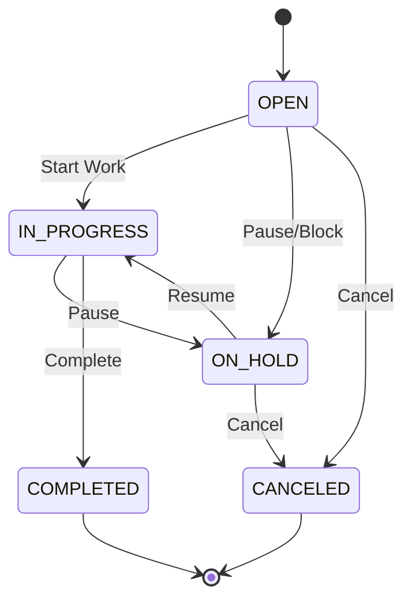
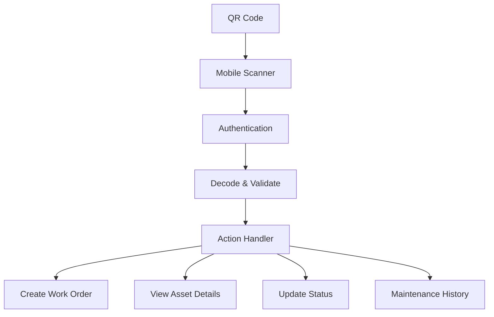
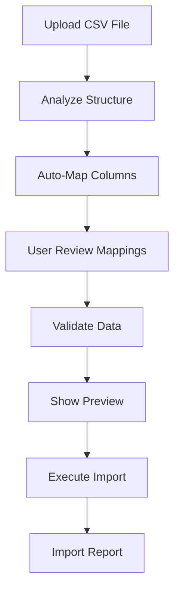

# 🚀 Feature Documentation

Complete guide to all features and capabilities in the Compass CMMS system.

## 📋 Table of Contents

- [Core Features](#core-features)
- [Asset Management](#asset-management)
- [Work Order System](#work-order-system)
- [Preventive Maintenance](#preventive-maintenance)
- [Inventory Management](#inventory-management)
- [Notification System](#notification-system)
- [QR Code Integration](#qr-code-integration)
- [Public Portals](#public-portals)
- [Import/Export System](#importexport-system)
- [Reporting & Analytics](#reporting--analytics)
- [Mobile Features](#mobile-features)
- [Advanced Features](#advanced-features)

## Core Features

### Multi-Tenant Organization Support
- **Organization-based data isolation**
- **Custom branding per organization**
- **Configurable settings and preferences**
- **Role-based access control within organizations**

### User Management
- **Three primary roles**: Admin, Manager, Technician
- **Granular permission system**
- **User profile management**
- **Activity tracking and audit trails**

### Real-Time Updates
- **WebSocket-powered live updates**
- **Instant notifications**
- **Collaborative work order updates**
- **Live dashboard metrics**

## Asset Management

### Asset Lifecycle Tracking

**Core Asset Information:**
```typescript
interface Asset {
  // Basic Information
  name: string;
  description?: string;
  serialNumber?: string;
  modelNumber?: string;
  manufacturer?: string;
  year?: number;
  
  // Status & Classification
  status: 'ONLINE' | 'OFFLINE';
  criticality: 'LOW' | 'MEDIUM' | 'HIGH' | 'IMPORTANT';
  
  // Location & Organization
  location: Location;
  parent?: Asset; // For nested assets
  children: Asset[]; // Sub-components
  
  // Documentation
  imageUrl?: string;
  attachments: File[];
  qrCode?: QRCode;
}
```

**Key Features:**
- **Hierarchical asset structure** (parent-child relationships)
- **Custom fields** for industry-specific data
- **Photo and document attachments**
- **Maintenance history tracking**
- **Warranty and purchase information**
- **Depreciation tracking**

### Asset Status Management
- **Real-time status updates** (Online/Offline)
- **Status change notifications**
- **Automated status based on work orders**
- **Historical status tracking**

### Asset Search & Filtering
```typescript
interface AssetFilters {
  search?: string;           // Name, serial number, description
  status?: AssetStatus;      // Online/Offline
  criticality?: Criticality; // LOW/MEDIUM/HIGH/IMPORTANT
  locationId?: number;       // Filter by location
  manufacturer?: string;     // Filter by manufacturer
  yearRange?: [number, number]; // Manufacturing year range
  hasQRCode?: boolean;      // Assets with QR codes
  hasUpcomingMaintenance?: boolean;
}
```

## Work Order System

### Work Order Lifecycle



### Work Order Types

**Reactive Maintenance:**
- Emergency repairs
- Breakdown responses
- Customer-reported issues
- Safety incidents

**Preventive Maintenance:**
- Scheduled inspections
- Routine servicing
- Time-based maintenance
- Usage-based maintenance

**Predictive Maintenance:**
- Condition-based maintenance
- Sensor-triggered work orders
- Trend analysis responses

### Work Order Components

**Task Management:**
```typescript
interface WorkOrderTask {
  id: number;
  title: string;
  description?: string;
  completed: boolean;
  completedAt?: Date;
  completedBy?: User;
  estimatedMinutes?: number;
  actualMinutes?: number;
}
```

**Time Tracking:**
```typescript
interface TimeLog {
  id: number;
  startTime: Date;
  endTime?: Date;
  duration: number; // minutes
  description?: string;
  technician: User;
  workOrderId: number;
}
```

**Parts & Inventory:**
```typescript
interface WorkOrderPart {
  part: Part;
  quantity: number;
  unitCost: number;
  totalCost: number;
  dateUsed: Date;
}
```

### Priority System
- **URGENT**: Immediate response required (< 1 hour)
- **HIGH**: Same day response (< 8 hours)
- **MEDIUM**: Next business day (< 24 hours)
- **LOW**: Scheduled within week (< 7 days)

### Assignment & Routing
- **Automatic assignment** based on skills and availability
- **Location-based routing** for field technicians
- **Workload balancing** across team members
- **Skill-based assignment** matching requirements

## Preventive Maintenance

### PM Schedule Types

**Time-Based Schedules:**
```typescript
interface PMSchedule {
  frequency: 'daily' | 'weekly' | 'monthly' | 'quarterly' | 'annually';
  interval: number; // Every X periods
  startDate: Date;
  endDate?: Date;
  
  // Time specifications
  preferredTime?: string; // HH:mm
  preferredDays?: DayOfWeek[];
  
  // Assignment
  assignedTo?: User;
  estimatedDuration: number; // minutes
}
```

**Usage-Based Schedules:**
```typescript
interface UsagePMSchedule {
  triggerType: 'hours' | 'cycles' | 'mileage' | 'production_units';
  triggerValue: number; // Trigger every X units
  tolerance: number; // +/- variance allowed
  
  currentReading: number;
  lastServiceReading: number;
  nextServiceDue: number;
}
```

**Condition-Based Schedules:**
```typescript
interface ConditionPMSchedule {
  sensorType: 'temperature' | 'vibration' | 'pressure' | 'oil_analysis';
  thresholdValue: number;
  currentValue: number;
  trendDirection: 'improving' | 'stable' | 'degrading';
  
  alertThreshold: number; // Warn before critical
  criticalThreshold: number; // Immediate action required
}
```

### PM Task Templates
```typescript
interface PMTask {
  title: string;
  description: string;
  estimatedMinutes: number;
  requiredSkills: string[];
  requiredTools: string[];
  requiredParts: Array<{
    partId: number;
    quantity: number;
  }>;
  safetyInstructions?: string;
  completionCriteria: string[];
}
```

### Auto-Generated Work Orders
- **Automatic work order creation** when PM is due
- **Pre-populated task lists** from PM templates
- **Automatic part reservations** for scheduled maintenance
- **Technician notifications** for upcoming PM work

## Inventory Management

### Parts Catalog

**Part Information:**
```typescript
interface Part {
  // Basic Information
  name: string;
  description?: string;
  sku: string; // Stock Keeping Unit
  category: PartCategory;
  
  // Inventory Tracking
  stockLevel: number;
  reorderPoint: number;
  maxStockLevel?: number;
  unitOfMeasure: string; // 'each', 'ft', 'gal', etc.
  
  // Costing
  unitCost: number;
  averageCost: number; // Weighted average
  lastCost: number; // Most recent purchase cost
  
  // Supplier Information
  primarySupplier?: Supplier;
  alternateSuppliers: Supplier[];
  
  // Physical Properties
  weight?: number;
  dimensions?: string;
  
  // Usage Tracking
  totalUsed: number;
  usageHistory: PartUsageHistory[];
}
```

### Stock Management
- **Real-time stock levels** with automatic updates
- **Reorder point alerts** when stock is low
- **Automatic purchase order generation** (optional)
- **Stock location tracking** within facilities
- **Inventory valuation** (FIFO, LIFO, Weighted Average)

### Supplier Management
```typescript
interface Supplier {
  name: string;
  contactInfo: {
    primaryContact: string;
    email: string;
    phone: string;
    address: Address;
  };
  
  // Business Information
  vendorNumber?: string;
  paymentTerms: string;
  leadTime: number; // days
  minimumOrder?: number;
  
  // Performance Metrics
  onTimeDelivery: number; // percentage
  qualityRating: number; // 1-5 stars
  priceRating: number; // 1-5 stars
  
  // Parts supplied
  parts: SupplierPart[];
}
```

### Purchase Orders
- **Automatic PO generation** based on reorder points
- **Multi-supplier consolidation** for efficiency
- **Approval workflows** for large purchases
- **Receiving and inspection** tracking
- **Invoice matching** and three-way matching

## Notification System

### Notification Types & Categories

```typescript
interface Notification {
  id: string;
  title: string;
  message: string;
  
  // Classification
  type: 'INFO' | 'WARNING' | 'ALERT' | 'SUCCESS';
  priority: 'LOW' | 'MEDIUM' | 'HIGH' | 'URGENT';
  category: NotificationCategory;
  
  // Delivery & Status
  channels: NotificationChannel[];
  isRead: boolean;
  readAt?: Date;
  isArchived: boolean;
  
  // Action
  actionUrl?: string;
  actionLabel?: string;
  
  // Metadata
  userId: number;
  createdAt: Date;
  expiresAt?: Date;
}

enum NotificationCategory {
  WORK_ORDER = 'Work Orders',
  ASSET = 'Assets',
  MAINTENANCE = 'Maintenance',
  INVENTORY = 'Inventory',
  SYSTEM = 'System',
  USER = 'User Account',
  PORTAL = 'Portal Submissions'
}
```

### Smart Notification Rules
```typescript
interface NotificationRule {
  trigger: {
    event: string; // 'work_order.overdue', 'asset.offline'
    conditions: Array<{
      field: string;
      operator: 'equals' | 'greater_than' | 'less_than';
      value: any;
    }>;
  };
  
  action: {
    channels: NotificationChannel[];
    template: string;
    delay?: number; // minutes
    escalation?: EscalationRule;
  };
  
  recipients: {
    roles: Role[];
    users: User[];
    conditions?: string; // "assigned_technician" | "asset_owner"
  };
}
```

### Notification Delivery Channels
- **In-App Notifications**: Real-time browser notifications
- **Email**: HTML and text email templates
- **SMS**: Critical alerts via text message
- **Push Notifications**: Mobile app notifications
- **WebSocket**: Live dashboard updates

### User Preferences
```typescript
interface NotificationPreferences {
  userId: number;
  preferences: Array<{
    category: NotificationCategory;
    channel: NotificationChannel;
    enabled: boolean;
    frequency: 'IMMEDIATE' | 'DIGEST' | 'WEEKLY';
    minimumPriority: NotificationPriority;
    quietHours?: {
      start: string; // "22:00"
      end: string;   // "08:00"
    };
  }>;
}
```

## QR Code Integration

### QR Code System Architecture



### QR Code Types
```typescript
interface QRCode {
  id: string;
  entityType: 'ASSET' | 'LOCATION' | 'WORK_ORDER';
  entityId: number;
  code: string; // Unique identifier
  
  // Configuration
  size: number; // pixels
  format: 'PNG' | 'SVG';
  
  // Security
  encryptionKey?: string;
  expiresAt?: Date;
  maxScans?: number;
  currentScans: number;
  
  // Metadata
  createdAt: Date;
  lastScannedAt?: Date;
  isActive: boolean;
}
```

### Quick Actions from QR Scan
**Asset QR Codes:**
- View asset details and status
- Create work order for asset
- View maintenance history
- Update asset status
- Report issue or problem

**Location QR Codes:**
- View location assets
- Create work order for location
- Check in/out of location
- Report facility issues

**Work Order QR Codes:**
- View work order details
- Update work order status
- Log time against work order
- Add photos or notes
- Mark tasks complete

### Security Features
- **Encrypted QR data** for sensitive information
- **Time-limited codes** for temporary access
- **Scan limit enforcement** for single-use codes
- **Device registration** for authorized scanners
- **Audit logging** of all QR code interactions

## Public Portals

### Portal Configuration System

```typescript
interface Portal {
  id: string;
  name: string;
  slug: string; // URL-friendly identifier
  description: string;
  
  // Status
  isActive: boolean;
  isPublic: boolean;
  requiresAuth: boolean;
  
  // Branding
  theme: {
    primaryColor: string;
    secondaryColor: string;
    logo?: string;
    favicon?: string;
    brandName: string;
  };
  
  // Form Configuration
  formConfig: PortalFormConfig;
  
  // Notifications
  notificationSettings: {
    adminEmails: string[];
    autoResponse: boolean;
    responseTemplate?: string;
  };
  
  // Access Control
  allowedDomains?: string[];
  ipWhitelist?: string[];
  
  // Analytics
  submissionCount: number;
  lastSubmission?: Date;
}
```

### Dynamic Form Builder
```typescript
interface PortalFormConfig {
  title: string;
  description?: string;
  
  fields: FormField[];
  
  // Validation
  validation: ValidationRule[];
  
  // Workflow
  onSubmit: {
    createWorkOrder: boolean;
    workOrderTemplate: WorkOrderTemplate;
    assignTo?: string; // role or user
    priority?: Priority;
    sendNotifications: boolean;
  };
  
  // UI Configuration
  layout: 'single-column' | 'two-column' | 'wizard';
  showProgressBar: boolean;
  successMessage: string;
  redirectUrl?: string;
}

interface FormField {
  id: string;
  type: 'text' | 'textarea' | 'select' | 'multiselect' | 'date' | 
        'location-picker' | 'asset-picker' | 'priority-selector' |
        'photo-upload' | 'file-upload';
  label: string;
  placeholder?: string;
  required: boolean;
  validation?: FieldValidation;
  
  // Type-specific configuration
  options?: SelectOption[]; // for select fields
  maxFiles?: number; // for file upload
  acceptedTypes?: string[]; // for file upload
}
```

### Portal Templates
**Maintenance Request Portal:**
- Location selection
- Issue description
- Priority selection
- Photo upload
- Contact information

**Tenant Request Portal:**
- Unit/apartment selection
- Issue category
- Urgency level
- Availability for repairs
- Photo attachments

**Equipment Report Portal:**
- Equipment selection
- Problem description
- Impact assessment
- Preferred repair time
- Safety concerns

### Integration Features
- **Automatic work order creation** from submissions
- **Email notifications** to appropriate staff
- **File attachment handling** with virus scanning
- **CAPTCHA protection** against spam
- **Custom success pages** and redirect options

## Import/Export System

### Intelligent CSV Import

**Import Process:**


**Smart Column Mapping:**
```typescript
interface ColumnMapping {
  csvColumn: string;
  targetField: string;
  confidence: number; // 0-100
  required: boolean;
  
  // Data transformation
  transformer?: {
    type: 'date' | 'number' | 'enum' | 'lookup';
    config?: any;
  };
  
  // Validation rules
  validation?: {
    required?: boolean;
    minLength?: number;
    maxLength?: number;
    pattern?: string;
    enum?: string[];
  };
}
```

**Fuzzy Matching Algorithm:**
```typescript
class ColumnMatcher {
  static matchColumns(csvHeaders: string[], targetFields: Field[]): ColumnMapping[] {
    const fuse = new Fuse(targetFields, {
      keys: ['label', 'aliases'],
      threshold: 0.3,
      includeScore: true
    });
    
    return csvHeaders.map(header => {
      const matches = fuse.search(header);
      const bestMatch = matches[0];
      
      return {
        csvColumn: header,
        targetField: bestMatch ? bestMatch.item.key : '',
        confidence: bestMatch ? Math.round((1 - bestMatch.score) * 100) : 0,
        required: bestMatch?.item.required || false
      };
    });
  }
}
```

### Export Templates

**Asset Export Template:**
```typescript
const ASSET_EXPORT_TEMPLATE = {
  name: 'Asset Export',
  fields: [
    { key: 'name', label: 'Asset Name', required: true },
    { key: 'serialNumber', label: 'Serial Number' },
    { key: 'status', label: 'Status', type: 'enum' },
    { key: 'location.name', label: 'Location', nested: true },
    { key: 'criticality', label: 'Criticality', type: 'enum' },
    { key: 'manufacturer', label: 'Manufacturer' },
    { key: 'modelNumber', label: 'Model Number' },
    { key: 'year', label: 'Year', type: 'number' },
    { key: 'createdAt', label: 'Date Created', type: 'date' }
  ],
  
  // Export options
  formats: ['CSV', 'XLSX', 'PDF'],
  maxRecords: 50000,
  includeImages: false,
  includeHistory: false
};
```

### Bulk Operations
- **Bulk asset creation** from CSV with validation
- **Bulk work order import** with assignment
- **User provisioning** from HR systems
- **Inventory updates** from supplier catalogs
- **Location hierarchy** import/export

## Reporting & Analytics

### Dashboard Metrics

**Key Performance Indicators:**
```typescript
interface DashboardMetrics {
  // Work Order Metrics
  workOrders: {
    total: number;
    open: number;
    inProgress: number;
    completed: number;
    overdue: number;
    
    // Trends
    completionRate: number; // percentage
    averageCompletionTime: number; // hours
    overdueRate: number; // percentage
  };
  
  // Asset Metrics
  assets: {
    total: number;
    online: number;
    offline: number;
    critical: number;
    
    // Health indicators
    uptimePercentage: number;
    maintenanceCompliance: number;
    criticalAssetsOffline: number;
  };
  
  // Maintenance Metrics
  maintenance: {
    pmCompliance: number; // percentage
    scheduledVsReactive: number; // ratio
    mtbf: number; // Mean Time Between Failures
    mttr: number; // Mean Time To Repair
  };
  
  // Inventory Metrics
  inventory: {
    totalValue: number;
    lowStockItems: number;
    stockouts: number;
    turnoverRate: number;
  };
}
```

### Custom Reports
**Report Builder Interface:**
```typescript
interface ReportDefinition {
  name: string;
  description?: string;
  
  // Data source
  entity: 'assets' | 'workOrders' | 'maintenance' | 'inventory';
  
  // Filters
  filters: Array<{
    field: string;
    operator: 'equals' | 'contains' | 'greater_than' | 'between';
    value: any;
  }>;
  
  // Grouping and aggregation
  groupBy?: string[];
  aggregations?: Array<{
    field: string;
    function: 'count' | 'sum' | 'avg' | 'min' | 'max';
    label: string;
  }>;
  
  // Output format
  columns: ReportColumn[];
  sortBy: Array<{
    field: string;
    direction: 'asc' | 'desc';
  }>;
  
  // Scheduling (for automated reports)
  schedule?: {
    frequency: 'daily' | 'weekly' | 'monthly';
    recipients: string[];
    format: 'pdf' | 'xlsx' | 'csv';
  };
}
```

### Analytical Reports
- **Asset Performance Reports** - uptime, failure rates, costs
- **Maintenance Effectiveness** - PM compliance, reactive vs preventive
- **Technician Productivity** - work completed, time utilization
- **Inventory Analysis** - turnover rates, carrying costs, stock optimization
- **Cost Analysis** - maintenance costs by asset, location, category

## Mobile Features

### Progressive Web App (PWA)
- **Offline functionality** with service worker caching
- **App-like experience** with custom splash screen
- **Push notifications** for critical alerts
- **Home screen installation** on mobile devices

### Mobile-Optimized Interface
```typescript
// Responsive design breakpoints
const BREAKPOINTS = {
  mobile: '320px',
  tablet: '768px',
  desktop: '1024px',
  wide: '1440px'
};

// Mobile-first component design
const AssetCard = styled.div`
  // Mobile-first (default)
  padding: 1rem;
  margin: 0.5rem;
  
  // Tablet and up
  @media (min-width: ${BREAKPOINTS.tablet}) {
    padding: 1.5rem;
    margin: 1rem;
  }
  
  // Desktop and up
  @media (min-width: ${BREAKPOINTS.desktop}) {
    padding: 2rem;
    display: grid;
    grid-template-columns: 1fr 2fr;
  }
`;
```

### QR Code Scanner
- **Native camera integration** using WebRTC
- **Real-time QR code detection** with automatic focus
- **Fallback manual entry** for damaged codes
- **Scan history** for recently scanned items
- **Batch scanning** for multiple assets

### Offline Capabilities
```typescript
// Service worker for offline functionality
class CMCSServiceWorker {
  // Cache critical resources
  static CACHE_RESOURCES = [
    '/',
    '/assets',
    '/work-orders',
    '/api/user/profile',
    '/static/css/main.css',
    '/static/js/main.js'
  ];
  
  // Sync strategies
  static SYNC_STRATEGIES = {
    '/api/work-orders': 'network-first',
    '/api/assets': 'cache-first',
    '/api/notifications': 'network-only'
  };
  
  // Background sync for offline actions
  async handleBackgroundSync(tag: string) {
    switch (tag) {
      case 'work-order-update':
        await this.syncWorkOrderUpdates();
        break;
      case 'time-log-entry':
        await this.syncTimeLogs();
        break;
    }
  }
}
```

## Advanced Features

### Artificial Intelligence & Machine Learning

**Predictive Analytics:**
- **Failure prediction** based on historical patterns
- **Optimal maintenance scheduling** using ML algorithms
- **Parts demand forecasting** for inventory optimization
- **Anomaly detection** in asset performance data

**Smart Recommendations:**
```typescript
interface SmartRecommendation {
  type: 'maintenance' | 'part_reorder' | 'technician_assignment';
  confidence: number; // 0-100
  reasoning: string;
  
  // Recommendation details
  asset?: Asset;
  suggestedAction: string;
  estimatedImpact: {
    cost?: number;
    downtime?: number; // hours
    efficiency?: number; // percentage improvement
  };
  
  // Implementation
  priority: 'low' | 'medium' | 'high';
  deadline?: Date;
  requiredApproval: boolean;
}
```

### API Integration Framework
```typescript
// Plugin system for third-party integrations
interface IntegrationPlugin {
  name: string;
  version: string;
  
  // Authentication
  authenticate(credentials: any): Promise<boolean>;
  
  // Data synchronization
  syncAssets?(): Promise<SyncResult>;
  syncWorkOrders?(): Promise<SyncResult>;
  syncUsers?(): Promise<SyncResult>;
  
  // Webhook handling
  handleWebhook?(event: WebhookEvent): Promise<void>;
  
  // Configuration
  getConfigSchema(): JSONSchema;
  validateConfig(config: any): boolean;
}

// Available integrations
const AVAILABLE_INTEGRATIONS = [
  'sap-integration',      // SAP ECC/S4 HANA
  'oracle-eam',          // Oracle Enterprise Asset Management
  'maximo-connector',    // IBM Maximo
  'servicenow-cmdb',     // ServiceNow CMDB
  'active-directory',    // Microsoft AD
  'quickbooks-sync',     // QuickBooks accounting
  'google-workspace',   // Google Workspace
  'microsoft-365'       // Microsoft 365
];
```

### White-Label Customization
```typescript
interface OrganizationBranding {
  // Visual branding
  logo: string;
  primaryColor: string;
  secondaryColor: string;
  fontFamily?: string;
  
  // Application branding
  applicationName: string;
  favicon: string;
  welcomeMessage?: string;
  
  // Email templates
  emailHeader: string;
  emailFooter: string;
  emailSignature: string;
  
  // Custom fields
  customFields: Array<{
    entity: string;
    fields: CustomField[];
  }>;
  
  // Feature toggles
  features: {
    enableQRCodes: boolean;
    enablePublicPortals: boolean;
    enableAdvancedReporting: boolean;
    enableMobileApp: boolean;
  };
}
```

This comprehensive feature documentation covers all major capabilities of the Compass CMMS system, providing detailed technical specifications and implementation details for each feature area.